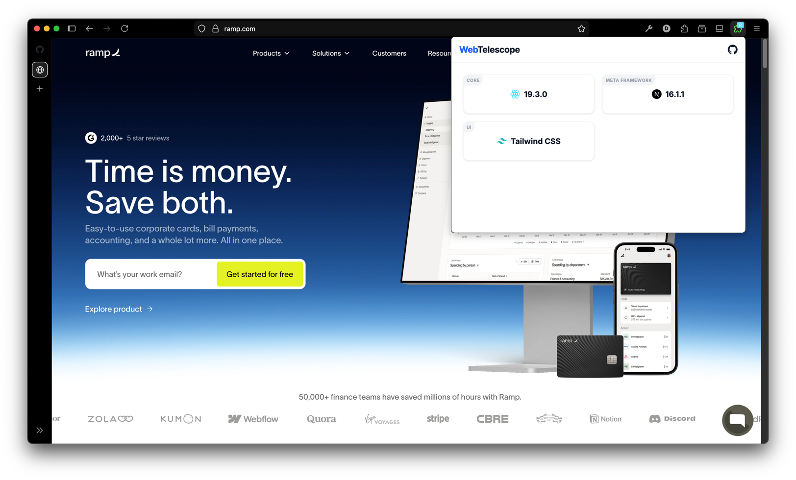
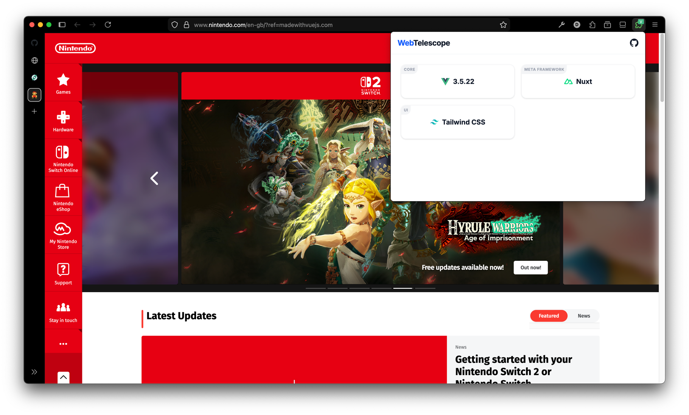
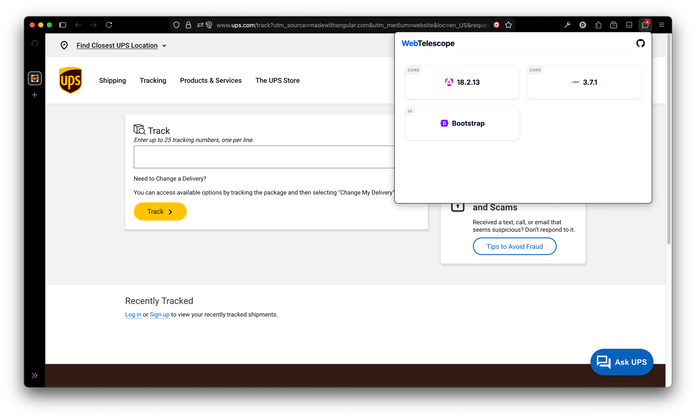

# WebTelescope - WXT + Vue 3

Browser extension that detects website technology stack.

### Detections:
- Core framework: React, Vue, Angular, Svelte, jQuery
- Meta framework: Next.js, Nuxt, Astro, VitePress, Gatsby
- UI library: TailwindCSS, MUI, Bootstrap

### Screenshots:

Inspired by https://github.com/nuxtlabs/vue-telescope-extensions
